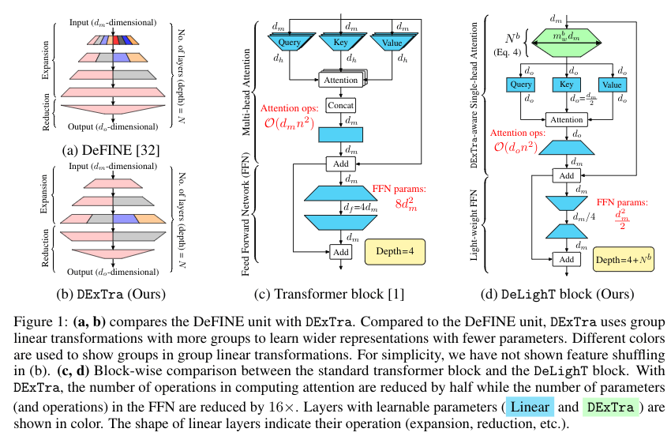
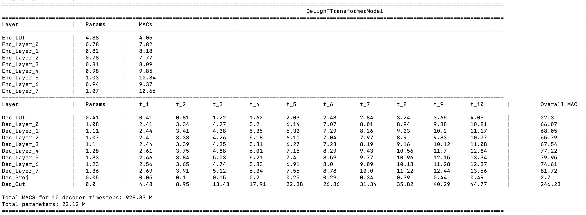

# DeLighT: Very Deep and Light-weight Transformers

This repository contains the source code of our work on building efficient sequence models: [DeFINE (ICLR'20)](https://openreview.net/pdf?id=rJeXS04FPH) and [DeLighT (preprint)](https://arxiv.org/pdf/2008.00623.pdf).


**Table of contents**
 1. [Overview](#overview)
 2. [Requirements and installation](#requirements-and-installation)
 3. [Training, evaluation, and results](#training-evaluation-and-results)
 4. [Multiplication-addition operations](#multiplication-addition-operations)
 5. [Citation](#citation)
 6. [Acknowledgement](#acknowledgements)
 7. [Issues](#issues)
 

## Overview
In this repository, we share the source code of our paper DeLight, that delivers  similar or better performance than 
transformer-based models with significantly fewer parameters. DeLighT more efficiently allocates parameters both (1) 
within each Transformer block using DExTra, a deep and light-weight transformation and (2) across blocks using 
block-wise scaling, that allows for shallower and narrower DeLighT blocks near the input and wider and deeper 
DeLighT blocks near the output. Overall, DeLighT networks are 2.5 to 4 times deeper than standard transformer models 
and yet have fewer parameters and operations. For details, see our papers: [DeFINE](https://openreview.net/pdf?id=rJeXS04FPH) and 
and [DeLighT](https://arxiv.org/pdf/2008.00623.pdf).




## Requirements and Installation
* [PyTorch](http://pytorch.org/) version >= 1.4.0
* Python version >= 3.6
* For training new models, you'll also need an NVIDIA GPU and [NCCL](https://github.com/NVIDIA/nccl)
* **To use DeLighT, you need to install fairseq** and develop locally:
```bash
git clone https://github.com/sacmehta/delight
cd fairseq
pip install --editable ./
```
* **For faster training** install NVIDIA's [apex](https://github.com/NVIDIA/apex) library:
```bash
git clone https://github.com/NVIDIA/apex
cd apex
pip install -v --no-cache-dir --global-option="--cpp_ext" --global-option="--cuda_ext" \
  --global-option="--deprecated_fused_adam" --global-option="--xentropy" \
  --global-option="--fast_multihead_attn" ./
```

## Training, Evaluation, and Results

For training, evaluation, and results, see below links. To ease reproduction of our results, we also provide links to training logs.

### Neural machine translation

* [WMT14 En2De](readme_files/nmt/wmt14_en2de.md) 
* [WMT14 En2Fr](readme_files/nmt/wmt14_en2fr.md)
* [WMT16 En2Ro](readme_files/nmt/wmt16_en2ro.md)


### Language Modeling

* [WikiText-103](readme_files/lm/wikitext103.md)

## Multiplication-Addition Operations

We have added module profiling for both Transformer and DeLight networks. This can be enabled using `--print-stats` argument. A model summary will be printed (by default for 20 tokens), similar to below screenshot. 
 To use larger sequence lengths for source and target for profiling statistics, you can use `--src-len-ps` and `--tgt-len-ps` flags.




## Citation
If you find our work useful, please consider citing following works:

``` 
@misc{mehta2020delight,
    title={DeLighT: Very Deep and Light-weight Transformer},
    author={Sachin Mehta and Marjan Ghazvininejad and Srinivasan Iyer and Luke Zettlemoyer and Hannaneh Hajishirzi},
    year={2020},
    eprint={2008.00623},
    archivePrefix={arXiv},
    primaryClass={cs.LG}
}
```

``` 
@inproceedings{mehta2019define,
  title={DeFINE: Deep Factorized Input Token Embeddings for Neural Sequence Modeling},
  author={Mehta, Sachin and Koncel-Kedziorski, Rik and Rastegari, Mohammad and Hajishirzi, Hannaneh},
  booktitle={International Conference on Learning Representations},
  year={2019}
}
```

## Acknowledgements

We would like to thank Fairseq team for building easy-to-use sequence library.

## Issues
Thanks for your interest in our work. For any issues, please raise a request.  